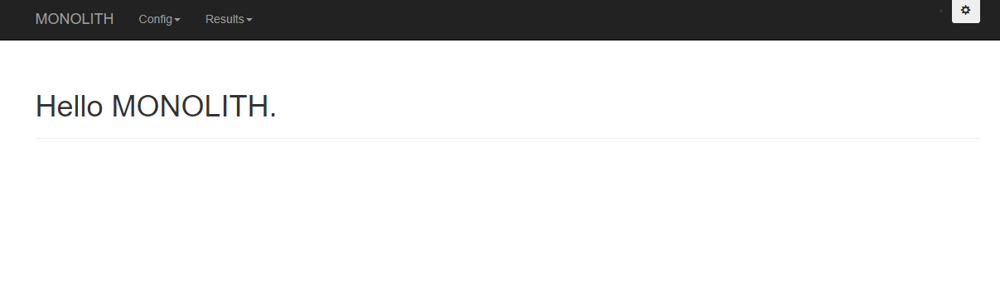
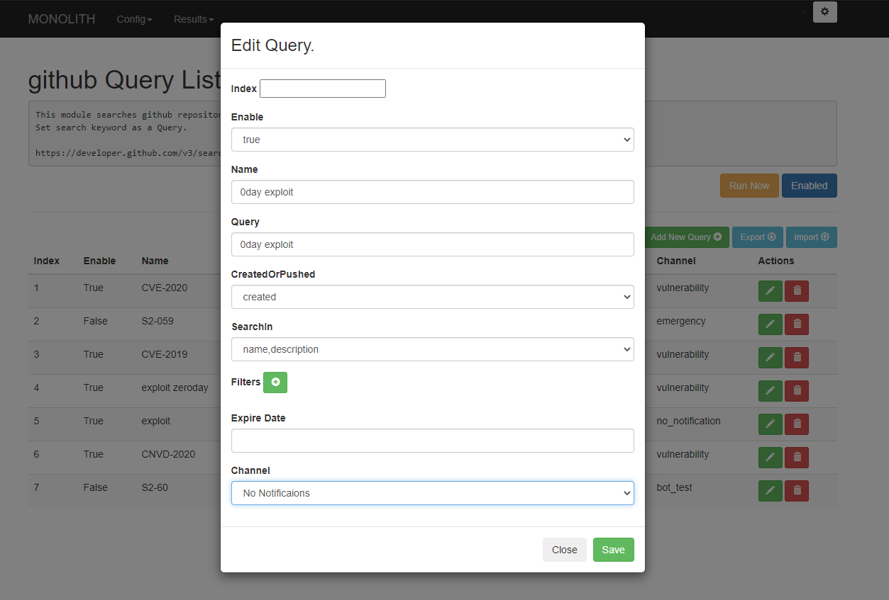
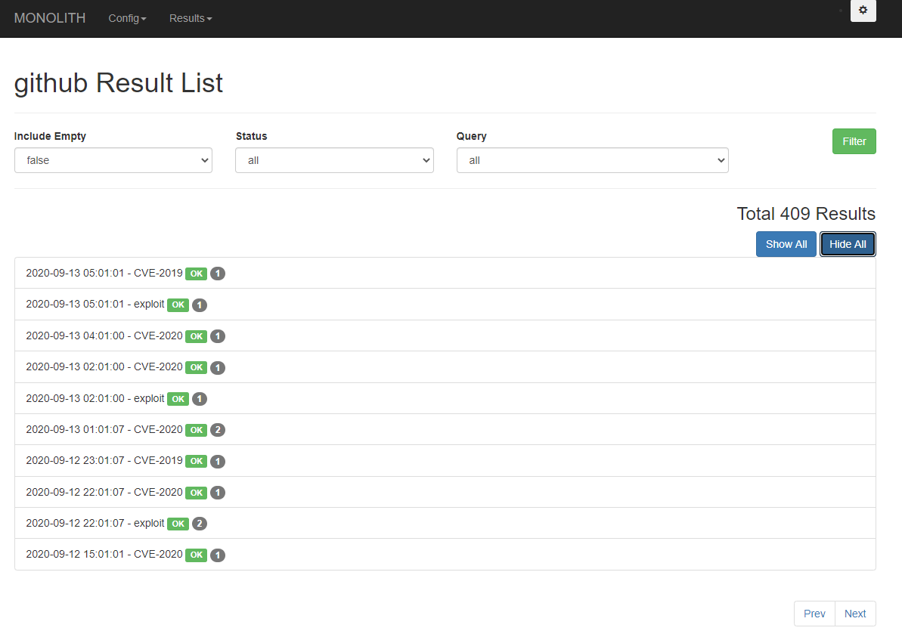
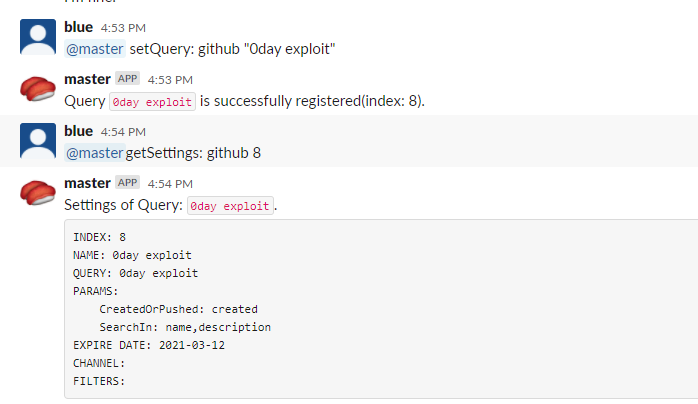

# Monolith

## Description
*Monolith* monitors information for threat hunting and notifies you of newly discovered information.

You can add and edit your own settings through Slackbot or the web UI.

Currently the following functions are implemented.

|Module|Description|Notes|
|---|---|---|
|github_repository_search|Search in Github and find new repositories||
|github_issues_search|Search in Github and find new issues||
|gist_search|Search in Github and find new Gist||
|gitlab_repository_search|Search in Gitlab and find new repositories||
|google_custom_search|Search with Google Custom Search and find web pages|Make Search Engine and set your Engine ID and API Token.|
|rss_feed|Get the RSS feeds||
|twitter|Search in Twitter||
|shodan_monitor|Search in SHODAN|SHODAN API Key is required.|
|urlscan_monitor|Search in urlscan.io||
|binaryedge_monitor|Search in binaryedge|binaryedge API Key is required.|
|newly_registered_domains|Get the domains registered on that day in WHOISDS and look for matches in the pattern.||
|urlhaus|Get specific malware information at URLhaus.||
|alienvault_pulse_search|Search the Pulse in AlienVault|AlienVault API Key is required.|
|dnstwister|Search for a domain name with dnstwister||

## Requirements
Requires MongoDB and Python3 and the libraries listed in the requirements.

Run the following command to install.

```
pip3 install -r requirements
```

Or, you can run it with docker-compose.

## Installation
### Run with Docker

```sh
https://github.com/blue1616/monolith.git
vim monolith/slackbot_settings.py # Edit the configuration.
docker-compose up -d
```

### Run withot Docker

```sh
pip3 install -r requirements
python3 run.py --db-host=localhost --db-port=27017 --db-name=monolith-database
```

```sh
python3 monolith_web.py --db-host=localhost --db-port=27017 --db-name=monolith-database
```

**monolith_web.py must be run after run.py**

## Usage
### Run Monolith
You need to edit slackbot_settings.py to use it.

- Required settings
  - API_TOKEN
    - Log in Slack and access [here](https://my.slack.com/services/new/bot). Create your Slackbot.
    - Set your Slackbot API Token
  - process_number
    - Set the number of processes to run
  - enable_slackbot
    - Set to False to disable query operations through Slackbot
    - You can be notified in Slack when you set to Flase
  - modules
    - Set Modules to enable
  - channels
    - Set slack channels that your slackbot join
    - Channels can also be added via the web UI after it has been run, but it is recommended that it be included here, as its settings will disappear after restarting
  - intervals
    - Set search execution time for each modules
    - Set in crontab format
  - user_keys
    - Set the API key required for each module

After successful launch, Slcak will receive the following notification
> ---Monolithbot Started. Loaded Modules are as follows.---
>
> github <br>
> github_issue <br>
> gist <br>
> ・・・

### Control Monolith
When operating in the Web UI, the service is waiting on port 5000.



Each search query has the following parameters.

|Parameter|Description|
|---|---|
|name|Query Name|
|query|Query. Content varies by module|
|params|Module Specific Parameters. Content varies by module|
|expire_date|Effective date. If the date is exceeded, the query will be invalidated automatically. Values that do not fit the date format will be treated as indefinite.|
|filters|Conditions to exclude from the results. It should be an exact match. Character "*" representing an arbitrary string of characters. The applicability depends on the module.|
|enable|Enable/Disable the search query.|
|channel|Set the Slack channel to be notified on. If a channel name is not in the channel list, you will not be notified|

Create new search queries and edit search queries from the web UI.



You can see the history of searches performed from the web UI.



Search queries can also be operated by commands via Slackbot.

Following command displays help.

```
@{Slackbot name} help:
```

Commands are below. See 'help:' command for specific usage.

|Command|Description|
|---|---|
|enableModule:|Enable Module|
|disableModule:|Disable Module|
|setQuery:|Register new search query|
|removeQuery:|Remove specified search query|
|enableQuery:|Enable specified search query|
|disableQuery:|Disable specified search query|
|setParam:|Set specific parameters for a search query|
|setExpireDate:|Set expiration date of specified search query|
|setChannel:|Set channel to notify of specified search query|
|addFilter:|Set new Filter for a search query|
|getQueries:|Display lists of Enabled Keywords|
|getAllQueries:|Display lists of all registered keyword|
|getSettings:|Display current settings of a search keyword|
|getJobState:|Display state of a module|
|help:|Display help|

The index is assigned to each search keywords. To change the setting, specify the index.



### Custom Modules
If you create a new module, place it in the "monolith/modules" folder and add the name of the module file in the modules section of slackbot_settings.py to enable it.

## Author
[blueblue](https://twitter.com/piedpiper1616)
