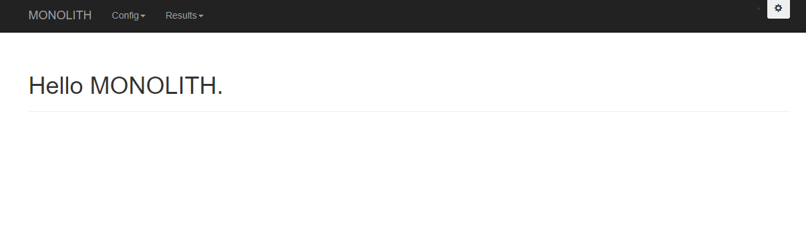
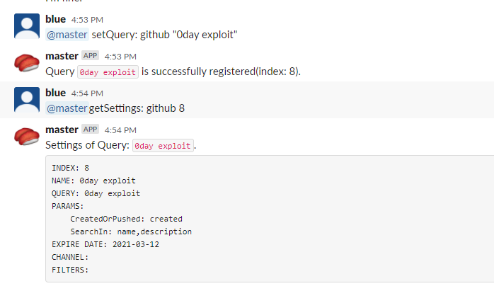

# Monolith

## 概要
脅威ハンティングのための情報を監視し、新たに見つかった情報を通知するシステムです

Slackbot もしくは Web UI から設定を自由に追加、編集が可能です

以下の機能が実装されています

|名前|説明|備考|
|---|---|---|
|github_repository_search|Github のリポジトリを検索します||
|github_issues_search|Github の issue を検索します||
|gist_search|Gist を検索します||
|gitlab_repository_search|Gitlab のリポジトリを検索します||
|google_custom_search|設定したエンジンでGoogle検索します|Google Custom Search の APIキーが必要です. 事前に検索エンジンを作成する必要があります|
|rss_feed|RSSフィードを取得します||
|twitter|Twitterを検索します||
|shodan_monitor|SHODAN を検索します|SHODAN の APIキーが必要です|
|urlscan_monitor|urlscan.io を検索します||
|binaryedge_monitor|binaryedge を検索します|binaryedge の APIキーが必要です|
|newly_registered_domains|WHOISDS でその日に登録されたドメインを取得し、パターンにマッチするものを探します||
|urlhaus|URLhaus で特定のマルウェアの情報を取得します||
|alienvault_pulse_search|AlienVault の Pulse を検索します|AlienVault の APIキーが必要です|
|dnstwister|dnstwister でドメイン名を検索します||
|passivetotal_ssl_cert|PassiveTotalでSSL証明書を検索し、その証明書を利用していたホストを探します|RiskIQ PassiveTotal の APIキーが必要です|
|passivetotal_subdomains|PassiveTotal でドメイン名を検索し、サブドメインを探します|RiskIQ PassiveTotal の APIキーが必要です|


## Requirements
MongoDB と Python3 及び requirements に記載のライブラリが必要です

以下のコマンドを実行してインストールしてください

```
pip3 install -r requirements
```

あるいは、docker-compose で動かすこともできます

## インストール
### Dockerで動かす

```sh
git clone https://github.com/blue1616/monolith.git
vim monolith/slackbot_settings.py # 設定ファイルを編集します
docker-compose up -d
```

### Dockerを利用しない場合

```sh
pip3 install -r requirements
python3 run.py --db-host=localhost --db-port=27017 --db-name=monolith-database
```

```sh
python3 monolith_web.py --db-host=localhost --db-port=27017 --db-name=monolith-database
```

**monolith_web.py は run.py の実行後に実行する必要があります**

## 使い方
### Monolith の起動
利用するには slackbot_settings.py が必要です

設定ファイルを編集します
- 必須項目
  - API_TOKEN
    - Slackにログインしたうえで、 [ここ](https://my.slack.com/services/new/bot) にアクセスし、ボットを作成します
    - 作成したSlackボットのAPI Token を記載します
  - process_number
    - 実行するプロセスの数を指定します
  - enable_slackbot
    - Slackbot によるクエリの操作を無効化する場合、False に設定してください
    - Slackbot によるクエリの操作をを無効化した場合でも、Slack への通知は可能です
  - modules
    - 有効にする Modules を指定します
  - channels
    - Slackボットに通知させる Slackチャンネルを指定します
    - 上記で作成した Slackボット をここに記載するチャンネルに参加させておいてください
    - Channle は実行後に Web UI からも追加できますが、再起動するとその設定は消えるため、ここに記載することを推奨します
  - intervals
    - 各モジュールの検索実行時間を設定します
    - crontab の形式で記載します
  - user_keys
    - 各モジュールの動作に必要な APIキーを設定します

Slcakbot の起動に成功すると、 Slcak に 以下のような通知が来ます
> ---Monolithbot Started. Loaded Modules are as follows.---
>
> github <br>
> github_issue <br>
> gist <br>
> ・・・

### Monolith の操作
Web UI で操作する場合、動作しているホストの 5000番ポートでサービスを待ち受けています



各検索クエリは以下のパラメータがあります

|パラメータ|説明|
|---|---|
|name|クエリ名|
|query|クエリ. モジュールによって内容が異なります|
|params|モジュール個別のパラメータ. モジュールによって内容が異なります|
|expire_date|有効期限. ここで記載した日付を超えるとクエリは自動で無効化されます. 日付のフォーマットに沿わないものは無期限扱いとなります|
|filters|結果から除外する条件です. 完全一致で記載し、「*」は任意の文字列を表します. 適用する項目はモジュールによって異なります|
|enable|検索クエリが有効/無効であることを表します|
|channel|通知する Slack チャンネルを指定します. チャンネルリストにないチャンネル名を指定した場合、通知されません|

Web UI から新たな検索クエリを作成、検索クエリの編集を行うことができます


また、Web UI からは実行された検索の履歴を確認することができます


検索クエリは Slackbot を通じたコマンドによって操作することも可能です

Slackボットに対して、以下のコマンドを送ると、コマンドのヘルプを表示します

```
@{Slackbotの名前} help:
```

コマンドの以下の通りです.
具体的な利用方法は help: コマンドを参照してください

|コマンド名|説明|
|---|---|
|enableModule:|モジュールを有効化します|
|disableModule:|モジュールを無効化します|
|setQuery:|新しい検索クエリを登録します|
|removeQuery:|指定した検索クエリを削除します|
|enableQuery:|指定した検索クエリを有効化します|
|disableQuery:|指定した検索クエリを無効化します|
|setParam:|指定した検索クエリの固有のパラメータを設定します|
|setExpireDate:|指定した検索クエリの有効期限を設定します|
|setChannel:|指定した検索クエリを通知するSlackチャンネルを指定します|
|addFilter:|検索クエリに新たなフィルタを設定します|
|getQueries:|設定されている検索クエリのうち有効化されているものの一覧を表示します|
|getAllQueries:|設定されている検索クエリの一覧を表示します|
|getSettings:|指定した検索クエリの現在の設定を表示します|
|getJobState:|モジュールのジョブの状態を表示します|
|help:|ヘルプを表示します|

登録されたキーワードには Index が振られます。設定の変更には Index を指定します。



### カスタムモジュール
新たにモジュールを作成した場合、「monolith/modules」フォルダに設置し、slackbot_settings.py の modules の項目に作成したモジュールのファイル名を追加することで有効化されます

## Author
[blueblue](https://twitter.com/piedpiper1616)
